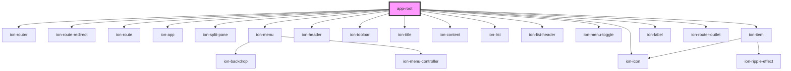

w# app-root

<!-- Auto Generated Below -->

## Dependencies

### Depends on

- ion-router
- ion-route-redirect
- ion-route
- ion-app
- ion-split-pane
- ion-menu
- ion-header
- ion-toolbar
- ion-title
- ion-content
- ion-list
- ion-list-header
- ion-menu-toggle
- ion-item
- ion-icon
- ion-label
- ion-router-outlet

### Graph

----------------------------------------------

*Built with [StencilJS](https://stenciljs.com/)*
