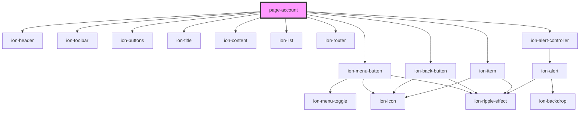

# page-account

<!-- Auto Generated Below -->

## Events

| Event           | Description | Type               |
| --------------- | ----------- | ------------------ |
| `userDidLogOut` |             | `CustomEvent<any>` |

## Dependencies

### Depends on

- ion-header
- ion-toolbar
- ion-buttons
- ion-menu-button
- ion-back-button
- ion-title
- ion-content
- ion-list
- ion-item
- ion-router
- ion-alert-controller

### Graph

----------------------------------------------

*Built with [StencilJS](https://stenciljs.com/)*
