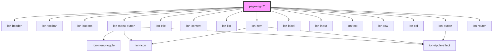

# page-login2

<!-- Auto Generated Below -->

## Events

| Event          | Description | Type               |
| -------------- | ----------- | ------------------ |
| `userDidLogIn` |             | `CustomEvent<any>` |

## Dependencies

### Depends on

- ion-header
- ion-toolbar
- ion-buttons
- ion-menu-button
- ion-title
- ion-content
- ion-list
- ion-item
- ion-label
- ion-input
- ion-text
- ion-row
- ion-col
- ion-button
- ion-router

### Graph

----------------------------------------------

*Built with [StencilJS](https://stenciljs.com/)*
