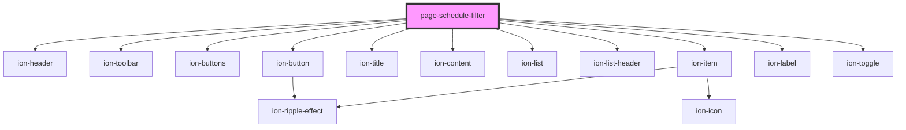

# page-schedule-filter

<!-- Auto Generated Below -->

## Properties

| Property         | Attribute | Description | Type       | Default |
| ---------------- | --------- | ----------- | ---------- | ------- |
| `excludedTracks` | --        |             | `string[]` | `[]`    |

## Dependencies

### Depends on

- ion-header
- ion-toolbar
- ion-buttons
- ion-button
- ion-title
- ion-content
- ion-list
- ion-list-header
- ion-item
- ion-label
- ion-toggle

### Graph

----------------------------------------------

*Built with [StencilJS](https://stenciljs.com/)*
