# page-schedule

<!-- Auto Generated Below -->

## Dependencies

### Depends on

- ion-header
- ion-toolbar
- ion-buttons
- ion-menu-button
- ion-segment
- ion-segment-button
- ion-button
- ion-icon
- ion-searchbar
- ion-content
- ion-list
- ion-item-group
- ion-item-divider
- ion-label
- ion-item-sliding
- ion-item
- ion-item-options
- ion-item-option
- ion-list-header
- ion-fab
- ion-fab-button
- ion-fab-list
- ion-alert-controller
- ion-loading-controller
- ion-modal-controller

### Graph

```mermaid
graph TD;
  page-schedule --> ion-header
  page-schedule --> ion-toolbar
  page-schedule --> ion-buttons
  page-schedule --> ion-menu-button
  page-schedule --> ion-segment
  page-schedule --> ion-segment-button
  page-schedule --> ion-button
  page-schedule --> ion-icon
  page-schedule --> ion-searchbar
  page-schedule --> ion-content
  page-schedule --> ion-list
  page-schedule --> ion-item-group
  page-schedule --> ion-item-divider
  page-schedule --> ion-label
  page-schedule --> ion-item-sliding
  page-schedule --> ion-item
  page-schedule --> ion-item-options
  page-schedule --> ion-item-option
  page-schedule --> ion-list-header
  page-schedule --> ion-fab
  page-schedule --> ion-fab-button
  page-schedule --> ion-fab-list
  page-schedule --> ion-alert-controller
  page-schedule --> ion-loading-controller
  page-schedule --> ion-modal-controller
  ion-menu-button --> ion-menu-toggle
  ion-menu-button --> ion-icon
  ion-menu-button --> ion-ripple-effect
  ion-segment-button --> ion-ripple-effect
  ion-button --> ion-ripple-effect
  ion-searchbar --> ion-icon
  ion-item --> ion-icon
  ion-item --> ion-ripple-effect
  ion-item-option --> ion-ripple-effect
  ion-fab-button --> ion-icon
  ion-fab-button --> ion-ripple-effect
  ion-alert-controller --> ion-alert
  ion-alert --> ion-ripple-effect
  ion-alert --> ion-backdrop
  ion-loading-controller --> ion-loading
  ion-loading --> ion-backdrop
  ion-loading --> ion-spinner
  ion-modal-controller --> ion-modal
  ion-modal --> ion-backdrop
  style page-schedule fill:#f9f,stroke:#333,stroke-width:4px
```

----------------------------------------------

*Built with [StencilJS](https://stenciljs.com/)*
