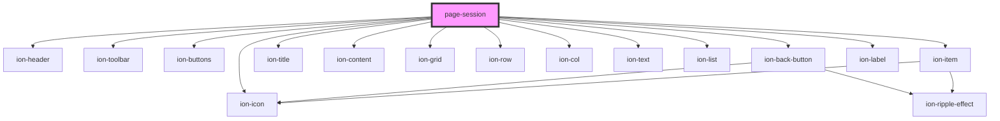

# page-session

<!-- Auto Generated Below -->

## Properties

| Property    | Attribute    | Description | Type     | Default     |
| ----------- | ------------ | ----------- | -------- | ----------- |
| `goback`    | `goback`     |             | `string` | `'/'`       |
| `sessionId` | `session-id` |             | `string` | `undefined` |

## Dependencies

### Depends on

- ion-header
- ion-toolbar
- ion-buttons
- ion-back-button
- ion-title
- ion-content
- ion-grid
- ion-row
- ion-col
- ion-icon
- ion-text
- ion-list
- ion-item
- ion-label

### Graph

----------------------------------------------

*Built with [StencilJS](https://stenciljs.com/)*
