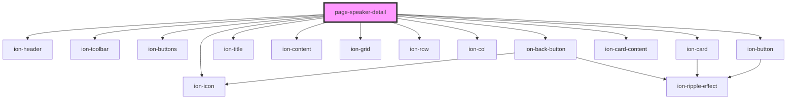

# page-speaker-detail

<!-- Auto Generated Below -->

## Properties

| Property    | Attribute    | Description | Type     | Default     |
| ----------- | ------------ | ----------- | -------- | ----------- |
| `speakerId` | `speaker-id` |             | `string` | `undefined` |

## Dependencies

### Depends on

- ion-header
- ion-toolbar
- ion-buttons
- ion-back-button
- ion-title
- ion-content
- ion-grid
- ion-row
- ion-col
- ion-card
- ion-card-content
- ion-button
- ion-icon

### Graph

----------------------------------------------

*Built with [StencilJS](https://stenciljs.com/)*
